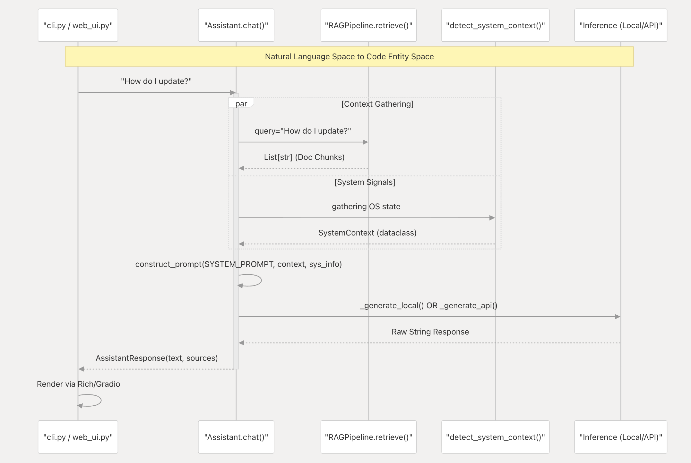
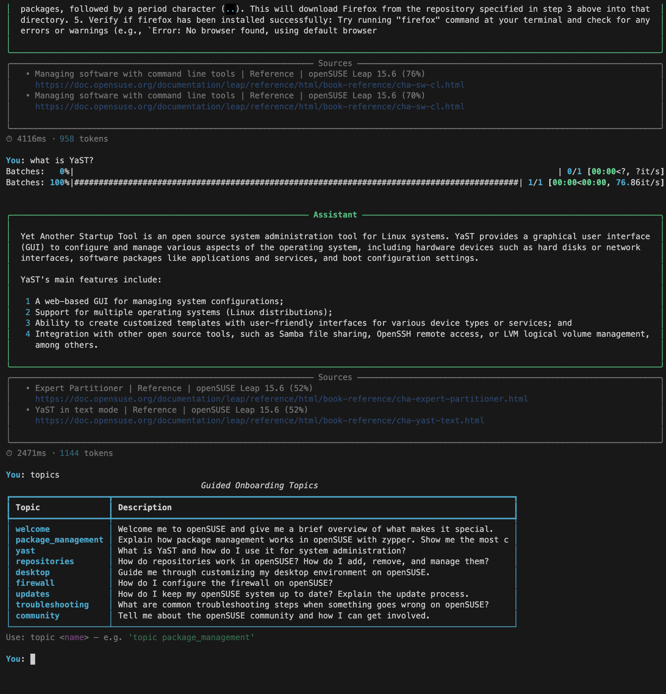
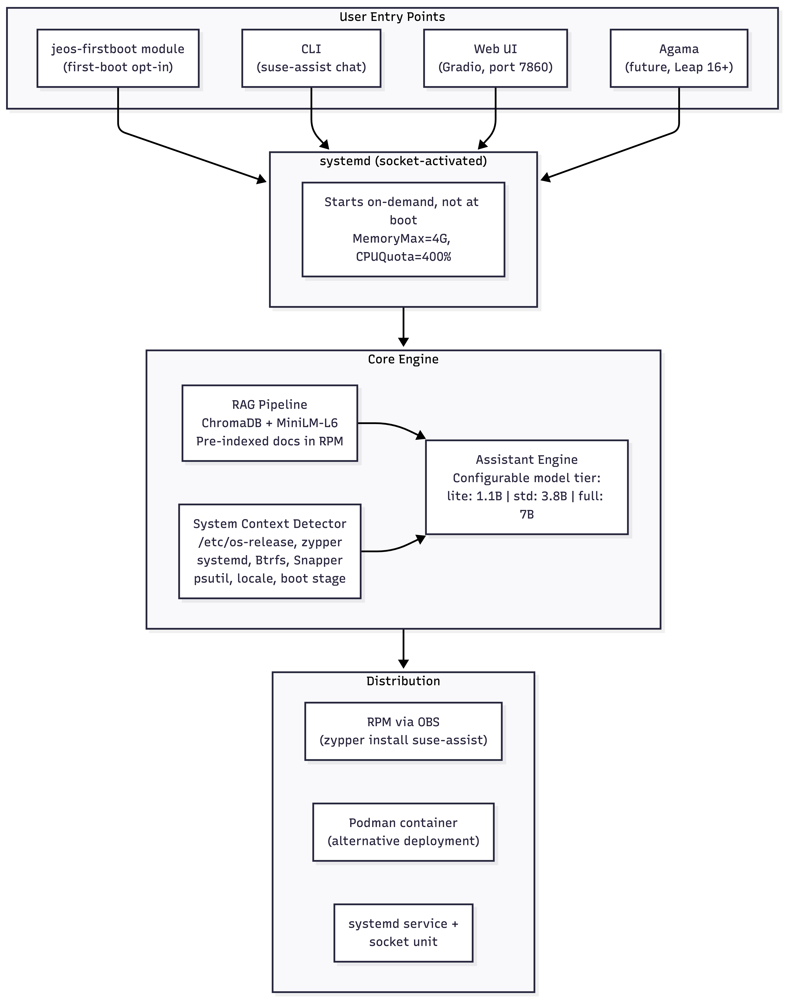

---
pdf_options:
  format: A4
  margin: 20mm
  displayHeaderFooter: true
  headerTemplate: '<span></span>'
  footerTemplate: '<div style="width:100%;text-align:center;font-size:10px;color:#888;"><span class="pageNumber"></span> / <span class="totalPages"></span></div>'
---

# AI-Powered Onboarding Experience for openSUSE Linux Distributions

## Applicant Information

| | |
|---|---|
| **Name** | Anuj Agrawal |
| **Professional** | [Atlan](https://atlan.com/), Ex: [Google](https://about.google/), [Zolidar](https://zolidar.com/), [FinesseFleet Corporation](https://www.linkedin.com/company/finessefleet) |
| **University** | SGGSIE&T, Nanded (Final Year B.Tech, Electronics & Telecommunications) |
| **Email** | anujagrawal380@gmail.com |
| **GitHub** | [github.com/anujagrawal380](https://github.com/anujagrawal380) |
| **Resume** | [Google Drive](https://drive.google.com/file/d/1wW04i1aTmOjUdhPGwh1629qpdYsGZqRY/view?usp=sharing) |
| **Recommendations** | [Google Drive](https://drive.google.com/file/d/1uhPM1jRhWLzYjySb5ln7TI9cNcrr1aLD/view?usp=sharing) |
| **LinkedIn** | [Anuj Agrawal](https://www.linkedin.com/in/anuj-agrawal380/) |
| **openSUSE Matrix** | [@anujagrawal:opensuse.org](https://matrix.to/#/@anujagrawal:opensuse.org) |
| **Timezone** | IST (UTC+5:30) |
| **Mentors** | @rudrakshkarpe, @satyampsoni |
| **Project Size** | Large (350 hours) |
| **Mentoring Issue** | [openSUSE/mentoring#259](https://github.com/openSUSE/mentoring/issues/259) |
| **Code Contribution (PoC)** | [openSUSE-leap-ai-startup-guide](https://github.com/anujagrawal380/openSUSE-leap-ai-startup-guide) |
| **CLI Demo** | [asciinema recording](https://asciinema.org/a/O8ubkqKc6Ih6U6LC) |
| **Live Demo** | [HuggingFace Spaces](https://huggingface.co/spaces/anujagawal/opensuse-leap-ai-guide) |
| **Code Contribution (openSUSE)** | [jeos-firstboot PR #135](https://github.com/openSUSE/jeos-firstboot/pull/135), [jeos-firstboot PR #136](https://github.com/openSUSE/jeos-firstboot/pull/136), [combustion PR #47](https://github.com/openSUSE/combustion/pull/47) |

---

## Synopsis

New openSUSE users often land in a world of powerful but unfamiliar tools: zypper, YaST, Snapper, Btrfs, and a packaging ecosystem that works differently from what they may have used before. The official documentation is thorough, but for someone just getting started, knowing *where to look* and *what applies to their system* is half the battle. There is currently no built-in assistant that can meet users where they are, understand their system's state, and walk them through their first hours with openSUSE.

This project proposes building that assistant: a locally-running Small Language Model (SLM) paired with a Retrieval-Augmented Generation (RAG) pipeline over official openSUSE documentation. The assistant detects the user's actual system context (desktop environment, pending updates, failed services, filesystem layout) and grounds every answer in real documentation and real system signals. It runs fully offline after setup, respects user privacy by keeping all data on the machine, and is designed for integration into the openSUSE first-boot experience.

To validate the architecture and demonstrate my commitment, I have already built a working proof of concept: local inference with TinyLlama 1.1B, a ChromaDB-backed RAG pipeline, system context detection, both CLI and Web UI interfaces, containerized deployment, and a benchmarking framework. The PoC is live on [HuggingFace Spaces](https://huggingface.co/spaces/anujagawal/opensuse-leap-ai-guide), a [CLI demo](https://asciinema.org/a/O8ubkqKc6Ih6U6LC) is available on asciinema, and the source is public on [GitHub](https://github.com/anujagrawal380/openSUSE-leap-ai-startup-guide). The PoC is a starting point, not a final solution. This proposal focuses on what comes next: collaborating with mentors on model selection, hardening the system, packaging it as an RPM via OBS, integrating with openSUSE's first-boot workflow, and making it production-ready for real users.

---

## Motivation and Background

### Why I care about this

I have been contributing to open source for the last two years, mostly in the CNCF and Wikimedia ecosystems. One pattern I have seen across every project is that the hardest part for newcomers is not the code itself, but figuring out how to get started. Linux distributions are no different. I remember my own early days with Linux, spending hours searching forums for answers that turned out to be two commands away. An intelligent assistant that already knows the documentation and can see your system's state would have saved me (and many others) a lot of frustration.

### Why openSUSE specifically

openSUSE has some of the most capable system management tools in the Linux world. YaST alone covers everything from firewall configuration to boot loader setup. Snapper with Btrfs gives users rollback superpowers that most distributions do not offer. But these tools have a learning curve, and their documentation, while comprehensive, is spread across multiple guides and wikis. An AI assistant that can surface the right documentation at the right time, grounded in what the user's system actually looks like, would be a genuine differentiator for openSUSE.

### Why local, offline AI

Privacy matters. A locally-running SLM means no user data leaves the machine, no internet connection is required after initial setup, and users retain full control. This aligns with openSUSE's core philosophy of user freedom. The timing is right too: Small Language Models in the 3-4B parameter range now run comfortably on commodity hardware with 8 GB of RAM, producing genuinely useful responses for domain-specific tasks like system administration guidance.

No major Linux distribution currently ships a local AI onboarding assistant. openSUSE has the opportunity to be first.

### Benefits to the openSUSE Community

- **Lower the barrier to entry:** New users get immediate, contextual help instead of searching through multiple documentation sources
- **Showcase openSUSE's unique tools:** The assistant actively highlights YaST, Snapper, Btrfs, and zypper capabilities that differentiate openSUSE from other distributions
- **Offline and privacy-respecting:** Aligns with openSUSE's values; no cloud dependency, no data collection
- **Reusable infrastructure:** The RAG pipeline, system context detection, and packaging patterns can be extended by the community for other openSUSE tooling
- **Distribution differentiator:** No major Linux distribution ships anything like this today

### Related Work

There is no directly comparable project in the Linux distribution space. The closest efforts are:

- **mcphost (Leap 16 tech preview):** General-purpose MCP host with no openSUSE-specific knowledge, no bundled model, no documentation grounding. Complementary infrastructure, not an onboarding assistant
- **Liz (SUSE Rancher Prime):** Enterprise Kubernetes AI assistant built into Rancher Prime. Different layer (cluster management vs. distribution onboarding) and different audience (Rancher Prime users managing infrastructure vs. new openSUSE users learning the OS)
- **General-purpose AI assistants (ChatGPT, etc.):** Not grounded in the user's actual system state, not offline-capable, and not integrated into the distribution
- **man pages and tldr:** Static reference material without conversational interaction or system awareness
- **openSUSE's existing documentation:** Comprehensive but requires the user to know what to search for; the assistant bridges that gap by understanding the question in context

This project is differentiated by three things: it runs entirely locally (privacy), it detects and uses real system state (relevance), and it is integrated into the first-boot experience (discoverability).

---

## Current State: Proof of Concept

I built the PoC before writing this proposal to validate the architecture and demonstrate my intent. It is meant as a foundation to iterate on with mentor guidance, not as a finished product. Many decisions (model selection, packaging approach, integration points) are deliberately left open for collaborative discussion.

- **CLI Demo Recording:** [asciinema recording](https://asciinema.org/a/O8ubkqKc6Ih6U6LC)
- **Live Demo:** [HuggingFace Spaces](https://huggingface.co/spaces/anujagawal/opensuse-leap-ai-guide)
- **Source Code:** [GitHub](https://github.com/anujagrawal380/openSUSE-leap-ai-startup-guide)
- **Architecture Deep Dive:** [DeepWiki](https://deepwiki.com/anujagrawal380/openSUSE-leap-ai-startup-guide)


**Query to Response Flow** (generated via [DeepWiki](https://deepwiki.com/anujagrawal380/openSUSE-leap-ai-startup-guide)):

<div align="center"></div>

**CLI Interface** showing guided onboarding topics, RAG-sourced answers with citations, and system-aware responses:

<div align="center"></div>

### What is already working

**Local SLM Inference** (`opensuse_ai/assistant.py`)
The core goal of this project is a locally-running assistant. The PoC runs TinyLlama 1.1B (Q4_K_M GGUF) via llama-cpp-python, fully offline with no data leaving the machine. The HuggingFace Spaces demo uses an API fallback purely because the free tier cannot compile native C++ dependencies, but the production system will be entirely local. The model choice is intentionally lightweight for the PoC; the final model will be selected collaboratively with mentors in Week 1.

**RAG Pipeline over openSUSE Documentation** (`opensuse_ai/rag.py`, `opensuse_ai/scraper.py`)
A documentation scraper crawls doc.opensuse.org (Startup Guide and Reference Guide), and the content is chunked, embedded with sentence-transformers, and stored in ChromaDB. When a user asks a question, the most relevant documentation chunks are retrieved and injected into the LLM prompt, grounding every answer in official sources rather than relying on the model's training data alone.

**System Context Detection** (`opensuse_ai/system_context.py`)
The assistant reads live signals from the host: distribution info from `/etc/os-release`, pending zypper updates, failed systemd services, desktop environment, memory and disk usage, and kernel info. This context is injected into every prompt so the assistant's answers reflect the user's actual system state, not generic Linux advice.

**User Interfaces** (`opensuse_ai/cli.py`, `opensuse_ai/web_ui.py`)
Both a CLI (Rich-powered terminal UI) and a Web UI (Gradio) are implemented, sharing the same assistant engine. Nine guided onboarding topic flows are included covering package management, YaST, firewall, repositories, and more.

**Benchmarking and Evaluation** (`opensuse_ai/benchmark.py`, `docs/llm-comparison.md`)
A benchmarking framework measures latency, throughput, and memory usage across standard openSUSE queries. A separate [LLM comparison document](https://github.com/anujagrawal380/openSUSE-leap-ai-startup-guide/blob/main/docs/llm-comparison.md) evaluates 7 candidate models with hardware-based recommendations, providing a starting point for the model selection discussion with mentors.

**Container Deployment** (`Containerfile`, `compose.yaml`)
Multi-stage OCI container build with a non-root user, read-only root filesystem, and resource constraints. Designed for Podman and Docker, providing a baseline for the RPM packaging work planned during GSoC.

---

## Technical Architecture:

The PoC validates the core idea and provides a foundation to build on. The production architecture expands on it with proper packaging, service management, and distribution integration. The specific model choices and integration details below are proposed starting points that will be refined through mentor discussion.

<div align="center"></div>

### Key Architectural Decisions

**Model Tiers:** Instead of a single hardcoded model, the production system supports three tiers that users can choose based on their hardware. The PoC uses TinyLlama 1.1B to validate the architecture, but the final model selection will be made collaboratively with mentors based on the [LLM comparison research](https://github.com/anujagrawal380/openSUSE-leap-ai-startup-guide/blob/main/docs/llm-comparison.md) I have already prepared. The likely candidates for the default tier are Phi-3.5 Mini (3.8B, MIT, 128K context) or Qwen2.5 3B (Apache 2.0, multilingual). Selection happens via `config.yaml` or is auto-detected based on available RAM.

**Pre-indexed Vector Store:** The RPM ships with a pre-built ChromaDB database containing embedded openSUSE documentation. Users never need to run `suse-assist ingest` manually. This eliminates the need for internet access during first-boot and ensures instant availability.

**Socket Activation:** The assistant runs as a systemd socket-activated service. It consumes zero RAM until a user actually invokes it, which is critical for systems with limited resources. When a user runs `suse-assist chat` or connects to the web UI port, systemd starts the service on demand.

**Resource Budget:** Target is 2-3 GB RAM for the default model tier (Phi-3.5 Mini + embeddings + vector store), leaving the rest of the system's memory available. The systemd unit enforces hard limits.

---

## Implementation Plan

### Deliverables Summary

| Deliverable | Priority | Phase |
|---|---|---|
| Tiered model configuration with benchmarks | Required | 1 |
| Enhanced RAG pipeline (4+ doc sources) | Required | 1 |
| Expanded system context detection and onboarding topics | Required | 1 |
| jeos-firstboot module for first-boot integration | Required | 2 |
| systemd service with socket activation | Required | 2 |
| Agama integration design document | Optional | 2 |
| RPM package on OBS (installable via zypper) | Required | 3 |
| `suse-assist setup` model download wizard | Required | 3 |
| Security hardening and `suse-assist doctor` | Required | 3 |
| Performance evaluation report across hardware tiers | Required | 4 |
| User and developer documentation | Required | 4 |
| Blog post for openSUSE News | Required | 4 |

### Community Bonding Period (Before Week 1)

Before coding begins, I will use the community bonding period to set up the foundation for a productive GSoC:

- Join openSUSE communication channels (Matrix, Telegram, mailing lists) and introduce myself to the broader community
- Set up an openSUSE Leap VM and a JeOS image for development and testing
- Create an OBS account at build.opensuse.org and familiarize myself with the `osc` workflow by building a test package
- Align with mentors on communication cadence, preferred channels, and expectations
- Review jeos-firstboot and Agama codebases in depth to prepare for integration work
- Finalize the LLM comparison document based on any mentor feedback received before coding starts

### Phase 1: Foundation and Model Optimization (Weeks 1-3)

**Week 1: Model Selection and Evaluation**

The PoC uses TinyLlama 1.1B to demonstrate the architecture, but model selection for production is an open question that needs to be resolved collaboratively with mentors. I have already prepared an [LLM comparison document](https://github.com/anujagrawal380/openSUSE-leap-ai-startup-guide/blob/main/docs/llm-comparison.md) evaluating 7 candidate models across size, context window, RAM requirements, license, and quality. This week is about turning that research into a concrete decision.

- Discuss the comparison document with mentors to align on model choice, weighing factors like hardware targets, license compatibility (Apache 2.0 vs MIT vs Llama license), multilingual needs, and RAM constraints
- Set up an openSUSE Leap VM and run hands-on evaluations of the top candidates (likely Phi-3.5 Mini, Qwen2.5 3B, and Mistral 7B) using the existing benchmarking framework
- Implement a tiered model configuration in `config.py` with `lite`, `standard`, and `full` tiers based on the agreed-upon selection
- Update `assistant.py` to resolve tier to the correct model repo, filename, and context window settings
- Deliverable: agreed model selection with mentor sign-off, tiered config working, benchmark comparison report
- Verification: `suse-assist benchmark` produces valid metrics for each tier on the Leap VM

**Week 2: RAG Pipeline Enhancement**

The current pipeline scrapes two doc sources with 500-char chunks. With Phi-3.5 Mini's 128K context window, we can increase chunk sizes and retrieval depth for better answers.

- Add new documentation sources: openSUSE Wiki (SDB articles), Leap release notes, openSUSE security guide
- Implement incremental ingestion so already-indexed pages are skipped on re-runs
- Increase chunk_size to 1000 and top_k to 4 for models with larger context windows
- Add source-type metadata filtering (let the retriever weight official docs over wiki pages)
- Deliverable: 4+ documentation sources indexed, improved retrieval quality
- Verification: side-by-side answer comparison on the 8 benchmark queries shows measurable improvement

**Week 3: System Context Enhancement and New Onboarding Flows**

The current system context detector covers basics (OS info, zypper, systemd, memory/disk). This week adds openSUSE-specific signals and new onboarding topics.

- Detect Btrfs/Snapper setup, network configuration (NetworkManager vs wicked), GPU presence, system locale and language
- Add boot-stage-aware prompt adaptation: different system prompts for first-boot vs. daily use
- Create 4 new onboarding topics: `snapper` (rollback guidance), `networking`, `virtualization`, `development_setup`
- Deliverable: richer system context, 13 total onboarding topics
- Verification: `suse-assist sysinfo` on openSUSE VM shows all new fields

---

### Phase 2: Integration and Interfaces (Weeks 4-6)

**Week 4: jeos-firstboot Module**

jeos-firstboot is the modern, lightweight first-boot configuration system for openSUSE. It uses a plugin architecture where bash modules in `/usr/share/jeos-firstboot/modules/` are executed during first boot. This is the primary integration point for the onboarding assistant. I have already started contributing to this codebase: [PR #135](https://github.com/openSUSE/jeos-firstboot/pull/135) fixes an undefined function bug in jeos-config, and [PR #136](https://github.com/openSUSE/jeos-firstboot/pull/136) adds `ConditionFirstBoot=yes` as an alternative service trigger, which is directly relevant to this project's systemd integration.

- Build on my existing understanding of the jeos-firstboot module system (metadata format, lifecycle hooks: `systemd_firstboot()`, `post()`, `jeos_config()`)
- Write a bash module that presents an opt-in prompt: "Would you like to start the AI onboarding assistant?"
- Detect whether a graphical session is available (launch web UI) or terminal-only (launch CLI)
- Handle the case where the model is not yet downloaded: offer to download or skip gracefully
- Deliverable: working jeos-firstboot module, tested on a JeOS image
- Verification: fresh JeOS VM boot triggers the module, assistant launches successfully

**Week 5: systemd Service and Socket Activation**

The assistant needs to run as a proper system service with on-demand activation and resource constraints.

- Create `suse-assist.service` (Type=simple) and `suse-assist.socket` (ListenStream=7860) unit files
- Implement socket activation: the web UI starts only when a connection arrives on port 7860
- Create a `suse-assist-firstboot.service` variant with `ConditionFirstBoot=yes`
- Configure systemd-tmpfiles for `/var/lib/suse-assist/` (vector store and model cache)
- Add resource limits: `MemoryMax=4G`, `CPUQuota=400%`, `ProtectSystem=strict`
- Deliverable: unit files working, socket activation tested, resource-constrained service
- Verification: `systemctl start suse-assist` launches the service; connecting to port 7860 triggers socket activation

**Week 6: Agama Integration Exploration**

Agama is the new web-based installer replacing YaST for Leap 16+. It has a Rust backend with an HTTP API, making it a natural integration surface. This week is explicitly exploratory, not a hard deliverable.

- Study Agama's architecture: agama-server (Rust), D-Bus services, web frontend, HTTP/JSON API
- Identify the integration surface: post-install hook via Agama's product YAML configuration
- Prototype: add a step in Agama's product config that enables the suse-assist systemd service after installation
- Write an integration design document describing the Agama path for Leap 16
- Deliverable: design document, prototype configuration file
- Verification: document reviewed and validated by mentor

---

### Mid-Term Evaluation Checkpoint (End of Week 6)

By mid-term, the following should be complete and demonstrable:

- **Working assistant** with the selected production model, tiered configuration, and enhanced RAG pipeline (4+ doc sources)
- **System context detection** covering Btrfs/Snapper, networking, GPU, locale, and boot-stage awareness
- **13 onboarding topics** accessible via CLI and Web UI
- **jeos-firstboot module** tested on a JeOS image
- **systemd service** with socket activation and resource limits
- **Agama integration design document** reviewed by mentor

At this point the assistant works end-to-end on an openSUSE Leap VM with first-boot integration. The second half focuses on making it distributable: RPM packaging, OBS, security, testing, and documentation.

---

### Phase 3: Packaging and Distribution (Weeks 7-9)

This phase is entirely about rollout. Building the software is only half the story; getting it packaged, distributed, and installable through standard openSUSE workflows is what makes it real.

**Week 7: RPM Spec File and OBS Setup**

- Write the RPM spec file for `suse-assist` with proper dependency management:
  - BuildRequires: python3-devel, cmake, gcc-c++ (for llama-cpp-python native compilation)
  - Requires: python3-sentence-transformers, python3-chromadb, python3-click, python3-rich, python3-psutil, python3-PyYAML, python3-beautifulsoup4
- Create subpackages:
  - `suse-assist` (core: Python code, CLI entry point, systemd units, jeos-firstboot module)
  - `suse-assist-docs` (pre-built ChromaDB vector store with indexed openSUSE documentation)
  - `suse-assist-model-phi35` (Phi-3.5 Mini GGUF file for offline installation)
- File layout:
  - `/usr/bin/suse-assist`
  - `/etc/suse-assist/config.yaml`
  - `/usr/lib/systemd/system/suse-assist.service`
  - `/usr/lib/systemd/system/suse-assist.socket`
  - `/usr/share/jeos-firstboot/modules/suse-assist`
  - `/var/lib/suse-assist/vectorstore/`
  - `/var/lib/suse-assist/models/`
- Set up OBS project at build.opensuse.org
- Configure builds for x86_64 and aarch64
- Deliverable: building RPM on OBS, installable on openSUSE Leap
- Verification: `zypper install suse-assist` from the OBS repo works on a clean Leap VM

**Week 8: Model Distribution and Setup Wizard**

Models are too large to bundle in the main RPM (2-5 GB). This week implements a clean distribution strategy.

- Create `suse-assist setup` CLI command that handles first-run tasks:
  - Auto-detects available RAM and recommends a model tier
  - Downloads the selected model with progress indication
  - Verifies model integrity with SHA-256 checksums
  - Checks vector store presence and validity
  - Enables the systemd service
- Package model GGUF files as separate OBS subpackages for offline/air-gapped installations
- Implement a `suse-assist setup --offline` path that uses locally available model files
- Deliverable: `suse-assist setup` command working end-to-end, model subpackages on OBS
- Verification: full offline installation path tested on an air-gapped VM

**Week 9: Security Hardening and Resource Management**

A production assistant needs proper security boundaries and resource awareness.

- Create a dedicated `suseai` system user in the RPM `%pre` scriptlet
- Apply systemd sandboxing: `ProtectSystem=strict`, `ProtectHome=yes`, `PrivateTmp=yes`, `NoNewPrivileges=yes`, `ReadWritePaths=/var/lib/suse-assist`
- Implement prompt injection defenses: input length limits, output filtering, refusal to suggest destructive system commands
- Build a resource governor that auto-selects model tier based on available RAM at startup (falls back to lite tier if below 6 GB)
- Add `suse-assist doctor` command for self-diagnosis: checks model presence, vector store integrity, available RAM, systemd service status, and reports any issues
- Deliverable: hardened service, prompt injection test suite, doctor command
- Verification: security checklist passes; attempted prompt injections fail cleanly; resource governor selects appropriate model on 4 GB and 16 GB VMs

---

### Phase 4: Testing, Documentation, and Rollout (Weeks 10-12)

**Week 10: Comprehensive Testing**

- Expand the test suite with integration tests for the full chat flow (question in, grounded answer out)
- Test RPM installation and removal on clean VMs
- Test systemd service lifecycle (start, stop, socket activation, first-boot trigger)
- Run benchmarks on reference hardware configurations:
  - 4 GB RAM: verify lite tier works, document latency
  - 8 GB RAM: verify standard tier, document performance
  - 16 GB RAM: verify full tier, document quality improvement
- Test across environments: openSUSE Leap 15.6, JeOS, KDE Plasma, GNOME
- Test multilingual responses with Qwen2.5 3B (German, Spanish, Japanese)
- Deliverable: test results matrix, benchmark report for each hardware tier
- Verification: all tests pass, benchmark results documented

**Week 11: Documentation and User Guide**

- Write user-facing documentation:
  - Installation guide (RPM, container, source)
  - Configuration reference (`config.yaml` options, model tiers, RAG tuning)
  - Troubleshooting guide (common issues, `suse-assist doctor` usage)
- Write developer documentation:
  - Architecture overview with diagrams
  - How to add new documentation sources
  - How to add new onboarding topics
  - How to package and test a new model
- Write OBS packaging and maintenance guide
- Create a screencast showing the full user journey: install, first-boot, onboarding session
- Deliverable: complete documentation in `docs/`, screencast
- Verification: a new contributor can follow the developer docs to add a new onboarding topic

**Week 12: Final Integration and Submission**

- Incorporate all mentor feedback from prior weeks
- Final RPM builds on OBS with all fixes applied
- Write a blog post draft for [openSUSE News](https://news.opensuse.org/) describing the project
- Create a post-GSoC roadmap document
- Submit final evaluation materials
- Deliverable: final RPM on OBS, documentation complete, blog post draft, project summary
- Verification: mentor sign-off; clean end-to-end installation on a fresh Leap VM

---

## Week-by-Week Timeline

| Week | Phase | Key Deliverables | Hours | Cumulative |
|------|-------|-----------------|-------|------------|
| 1 | Foundation | Model selection with mentors, tiered config, benchmarks on Leap VM | 29 | 29 |
| 2 | Foundation | 4+ doc sources, incremental ingestion, tuned retrieval | 29 | 58 |
| 3 | Foundation | Btrfs/Snapper/locale detection, 4 new topics, boot-stage prompts | 29 | 87 |
| 4 | Integration | jeos-firstboot module, tested on JeOS image | 29 | 116 |
| 5 | Integration | systemd service + socket activation, resource limits | 29 | 145 |
| 6 | Integration | Agama exploration, integration design document | 29 | 174 |
| 7 | Packaging | RPM spec file, OBS project, multi-arch builds, subpackages | 29 | 203 |
| 8 | Packaging | `suse-assist setup` wizard, model distribution, offline install | 29 | 232 |
| 9 | Packaging | Security hardening, resource governor, `suse-assist doctor` | 29 | 261 |
| 10 | Rollout | Integration tests, multi-config testing, hardware benchmarks | 30 | 291 |
| 11 | Rollout | User docs, developer docs, OBS guide, screencast | 30 | 321 |
| 12 | Rollout | Mentor feedback, final OBS builds, blog post, project summary | 29 | **350** |

---

## Rollout Strategy

The mentor rightly emphasized that rollout is a major part of this project. Writing the code is necessary but not sufficient. Below is the detailed plan for getting the assistant into users hands through standard openSUSE distribution channels.

### RPM Packaging via OBS

The Open Build Service (OBS) at build.opensuse.org is the standard way to build and distribute packages for openSUSE. The assistant will be packaged as an RPM with the following structure:

**Subpackages:**
- `suse-assist`: Core Python package, CLI entry point (`/usr/bin/suse-assist`), configuration (`/etc/suse-assist/config.yaml`), systemd unit files, jeos-firstboot module
- `suse-assist-docs`: Pre-built ChromaDB vector store containing indexed openSUSE documentation. Separated so it can be updated independently when docs change
- `suse-assist-model-phi35`: Phi-3.5 Mini GGUF model file (~2.2 GB). Separate package for offline/air-gapped installations. Most users will download the model via `suse-assist setup` instead

**OBS Workflow:**
1. Create a home project (home:anujagrawal/suse-assist) during GSoC
2. Configure builds for openSUSE Leap 15.6+ on x86_64 and aarch64
3. Validate builds pass on OBS infrastructure
4. Long-term goal (post-GSoC): submit request to openSUSE:Factory for official inclusion

### systemd Integration

```ini
# /usr/lib/systemd/system/suse-assist.service
[Unit]
Description=openSUSE AI Onboarding Assistant
After=network.target

[Service]
Type=simple
User=suseai
ExecStart=/usr/bin/suse-assist web --port 7860
MemoryMax=4G
CPUQuota=400%
ProtectSystem=strict
ProtectHome=yes
PrivateTmp=yes
NoNewPrivileges=yes
ReadWritePaths=/var/lib/suse-assist

[Install]
WantedBy=multi-user.target
```

```ini
# /usr/lib/systemd/system/suse-assist.socket
[Unit]
Description=openSUSE AI Assistant Socket Activation

[Socket]
ListenStream=7860

[Install]
WantedBy=sockets.target
```

Socket activation ensures the service starts only when a user connects. On a system with 8 GB of RAM, the assistant consumes zero resources until someone actually asks for help.

### jeos-firstboot Module

```bash
# /usr/share/jeos-firstboot/modules/suse-assist
# Priority: 90 (runs near the end of firstboot)

title="AI Onboarding Assistant"
description="Start the openSUSE AI onboarding assistant for guided setup help"

jeos_config() {
    if dialog --yesno "Would you like to start the AI onboarding assistant?" 8 50; then
        if [ -f /var/lib/suse-assist/models/*.gguf ]; then
            systemctl enable --now suse-assist.socket
        else
            dialog --msgbox "Run 'suse-assist setup' to download the AI model first." 8 50
        fi
    fi
}
```

The module presents an opt-in prompt during first boot. If the model is available (from the `suse-assist-model-phi35` RPM or a prior `suse-assist setup` run), it enables the socket-activated service immediately. Otherwise, it guides the user to run setup later.

### Agama Integration Path (Forward-Looking)

Agama is the new installer for Leap 16+. Its product YAML configuration supports defining post-installation steps. The integration path is:

1. Add a configuration option in Agama's product YAML to enable the `suse-assist` service
2. In the future, a native Agama web module could embed the assistant directly in the installer UI, leveraging the existing Gradio API endpoint

This is explicitly scoped as exploration and design during GSoC, with implementation targeting post-GSoC work when Agama's API stabilizes further.

### Security Model

- **Dedicated user:** The `suseai` system user owns `/var/lib/suse-assist/` and has no login shell
- **systemd sandboxing:** Strict filesystem protection, private temp, no privilege escalation
- **No network required:** After model download, the assistant operates fully offline
- **Prompt injection mitigations:** Input length limits, output filtering for destructive commands, system prompt hardening to refuse executing commands
- **No telemetry:** No data collection by default. If added in the future, it will be strictly opt-in

---

## Performance and Resource Evaluation Plan

The PoC already includes a benchmarking framework (`opensuse_ai/benchmark.py`) that measures latency, throughput, and memory usage across 8 standard openSUSE queries. During GSoC, this will be expanded into a formal evaluation:

**Metrics:**
- Inference latency (average, P95, first-response time)
- Throughput (tokens per second)
- Memory footprint (baseline, model-loaded, peak during inference)
- Answer quality (manual scoring on a 1-5 scale across 20 openSUSE-specific questions)
- System impact (CPU and memory overhead while the assistant is running in the background)

**Hardware Matrix:**

| Configuration | RAM | Expected Tier | Key Question |
|---|---|---|---|
| Minimal VM / Raspberry Pi | 4 GB | lite (TinyLlama 1.1B) | Is it usable at all? |
| Typical laptop | 8 GB | standard (Phi-3.5 Mini) | Does it feel responsive? |
| Desktop / workstation | 16 GB | full (Mistral 7B) | How good can it get? |

**Multilingual Testing:**
The Qwen2.5 3B model supports 29 languages. Testing will cover German, Spanish, and Japanese, which represent major openSUSE community languages.

The final evaluation report will be published and included in the project documentation.

---

## Risk Assessment and Mitigation

| Risk | Likelihood | Impact | Mitigation |
|------|-----------|--------|------------|
| llama-cpp-python compilation fails on some architectures | Medium | High | Provide pre-compiled wheels on OBS; fallback to API mode for affected platforms |
| Default model too large for low-end hardware | Medium | Medium | Tiered model system with auto-detection; lite tier for 4 GB systems |
| RAG retrieval quality is insufficient for complex questions | Low | High | Tune chunk sizes, add re-ranking, expand documentation sources, evaluate embedding models |
| jeos-firstboot interface changes between Leap versions | Low | Medium | Keep the module minimal; test against multiple Leap versions |
| Agama API not stable enough for integration | High | Low | Scoped as exploratory; core path uses jeos-firstboot, not Agama |
| Prompt injection attacks | Medium | Medium | Input sanitization, output filtering, refuse destructive commands, hardened system prompt |
| OBS packaging complexity (Python + native deps) | Medium | Medium | Start early (Week 7); reference existing Python RPMs on OBS; seek mentor guidance |
| 350 hours insufficient for all deliverables | Low | High | Agama work is explicitly exploratory; core path (model + RAG + packaging + jeos-firstboot) is prioritized |

---

## About Me

### Professional Experience

I am currently an Associate Software Engineer (Intern) at Atlan, where I work on platform infrastructure with Kubernetes, Temporal, Helm, and Docker daily. Before that, I interned at Google as a Software Engineer, where I built systems that caught 2250+ resource inconsistencies for Google Cloud NetApp Volumes (GCNV) and implemented gCloud CLI support for new product launches. I have also interned at Zolidar (SaaS startup in Palo Alto) and FinesseFleet (Bengaluru). I have received [recommendations](https://drive.google.com/file/d/1uhPM1jRhWLzYjySb5ln7TI9cNcrr1aLD/view?usp=sharing) from all my past employers (including CNCF Karmada.IO community admins).

### Open Source Track Record

Open source is not something I do on the side. It is how I learned to be an engineer, and it has shaped how I think about collaboration, code quality, and community.

- **Karmada.IO (CNCF):** Selected as an LFX Mentee in 2024 and improved unit test coverage by 12.52% across the controller-manager and scheduler components and became a Reviewer.
- **Vitess (CNCF):** Active contributor to the Vitess database clustering system, working on refactors, Docker image upgrades, and test coverage improvements in Go.
- **Wikimedia Foundation:** Selected among 50 developers for the Wikimedia Hackathon. Contributed patches across the MediaWiki ecosystem and built a Bulk User Info Fetcher using Flask, React, and the Toolforge API.
- **OpenKruise, OpenMF, Rootly AI Labs, Latitude.sh:** Contributed across multiple communities, from Kubernetes rollout controllers to MCP server tooling to Terraform providers. I actively look for projects where I can make a meaningful impact.
- **Conferences:** Attended and presented at multiple open source conferences as a CNCF community representative.

I have internalized the open source philosophy through years of contributing, reviewing, and engaging with communities. I understand that writing code is just one part of the process; communication, documentation, and showing up consistently matter just as much.

### Why I Am a Strong Fit for This Project

I have been exploring LLMs, inference runtimes, and AI tooling for the past couple of years, both as personal interest and through my work at Google and Atlan. At Atlan, I work daily with Kubernetes, Temporal, Helm, and Docker on platform infrastructure, which translates directly to the systemd integration, container packaging, and service lifecycle work this project requires. At Google, I built production systems for a Cloud product, which gave me experience with building reliable, well-tested software at scale. The PoC I built for this proposal combines both of these worlds: local SLM inference with llama-cpp-python, a RAG pipeline over real documentation, and containerized deployment with proper resource constraints. This is not a new area for me; it is where my interests and skills naturally converge.

### Why This Project

This project sits at the intersection of AI systems and Linux platform engineering, which is exactly where my interests and skills meet. I have hands-on experience with both sides: building RAG pipelines and running local models, and working with containerized infrastructure, systemd services, and package management. I built the PoC not because it was required, but because I genuinely wanted to see if this idea could work. It can, and I want to take it all the way to something openSUSE users can actually install and use.

### Links

- **Resume:** [Google Drive](https://drive.google.com/file/d/1wW04i1aTmOjUdhPGwh1629qpdYsGZqRY/view?usp=sharing)
- **Recommendations:** [Google Drive](https://drive.google.com/file/d/1uhPM1jRhWLzYjySb5ln7TI9cNcrr1aLD/view?usp=sharing)
- **GitHub:** [github.com/anujagrawal380](https://github.com/anujagrawal380)
- **LinkedIn:** [Anuj Agrawal](https://www.linkedin.com/in/anuj-agrawal380/)
- **Portfolio:** [anujagrawal.me](https://anujagrawal.me)
- **LeetCode:** [anujagrawal](https://leetcode.com/u/anujagrawal699/)
- **Blogs:** [medium.com/@anujagrawal380](https://medium.com/@anujagrawal380)
- **PoC Repository:** [openSUSE-leap-ai-startup-guide](https://github.com/anujagrawal380/openSUSE-leap-ai-startup-guide)
- **PoC Architecture (DeepWiki):** [deepwiki.com/anujagrawal380/openSUSE-leap-ai-startup-guide](https://deepwiki.com/anujagrawal380/openSUSE-leap-ai-startup-guide)
- **CLI Demo:** [asciinema recording](https://asciinema.org/a/O8ubkqKc6Ih6U6LC)
- **Live Demo:** [HuggingFace Spaces](https://huggingface.co/spaces/anujagawal/opensuse-leap-ai-guide)
- **openSUSE Contributions:** [jeos-firstboot PR #135](https://github.com/openSUSE/jeos-firstboot/pull/135), [PR #136](https://github.com/openSUSE/jeos-firstboot/pull/136), [combustion PR #47](https://github.com/openSUSE/combustion/pull/47)

---

## Availability and Commitments

- I am currently working as an Associate Software Engineer (Intern) at Atlan. I will dedicate **32-35 hours per week** to GSoC. The platform engineering work at Atlan (Kubernetes, Temporal, containers) complements rather than conflicts with this project
- I am a final-year B.Tech student with limited coursework remaining, so academics will not be a constraint
- I have no planned vacations, exams, or other commitments that would conflict with the GSoC timeline
- Timezone: IST (UTC+5:30)
- I am committed to regular communication with my mentors (daily async updates, weekly sync calls, or whatever cadence works best) via openSUSE's preferred channels (Matrix, Telegram, mailing lists)
- I will publish at least two blog posts on [openSUSE News](https://news.opensuse.org/) (mid-term progress and final summary) to keep the broader community informed

---

## Contact

- **Email:** anujagrawal380@gmail.com
- **openSUSE Matrix:** [@anujagrawal:opensuse.org](https://matrix.to/#/@anujagrawal:opensuse.org)

---

## Post-GSoC Plans

This is not a project I plan to walk away from after the summer. My concrete plans for continued involvement:

- **Maintain the OBS package:** Keep `suse-assist` up to date with new Leap releases, model updates, and documentation refreshes
- **Work toward official inclusion:** Submit the package to openSUSE:Factory for inclusion in the distribution
- **YaST firstboot integration:** Build a YaST firstboot client as a complement to the jeos-firstboot module
- **Native Agama module:** Once Agama's API is stable, build a proper web module that embeds the assistant in the installer
- **Tumbleweed support:** Adapt the documentation pipeline and system context detection for rolling release
- **Multilingual documentation indexing:** Index German, Spanish, and Japanese openSUSE documentation for the global community
- **Community contribution:** Write guides and documentation to help other contributors extend the assistant with new topics, documentation sources, and models


